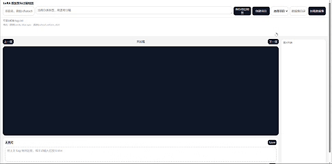

# MiniTags

MiniTags 是一个面向 LoRA 训练数据集的本地可视化标注编辑工具，用于快速检查、修正和管理图片对应的 `.txt` 标签文件。

## 功能

- 创建项目，并为每个项目维护独立的 `tags.txt`
- 支持从本地选择数据集目录
- 自动加载图片及同名 `.txt` 标注文件
- 支持自然排序浏览图片
- 支持拖拽标签到当前图片标注中
- 支持手动添加标签
- 支持删除已有标签
- 支持标签分类与同组互斥，例如：

```txt
[面部]:smile, blue eyes
[服装]:school uniform, skirt
[动作]:standing, sitting
[视线]:looking up:1, looking down:1
```

> 语法:` [类型]:tag1,tag2,tag3:1,tag4:1,tag5:2,tag2:2`
>
> 其中tag3和tag4互斥,tag5和tag6互斥

## 效果展示



## 安装与运行

### 1. 克隆项目

```bash
git clone https://github.com/fuyu2022/MiniTags.git
cd MiniTags
```

### 2. 安装依赖

```bash
pip install -r requirements.txt
```

### 3. 启动后端服务

```bash
uvicorn app:app --reload --host 127.0.0.1 --port 8000
```
###4.在浏览器中访问：

```
http://127.0.0.1:8000
```